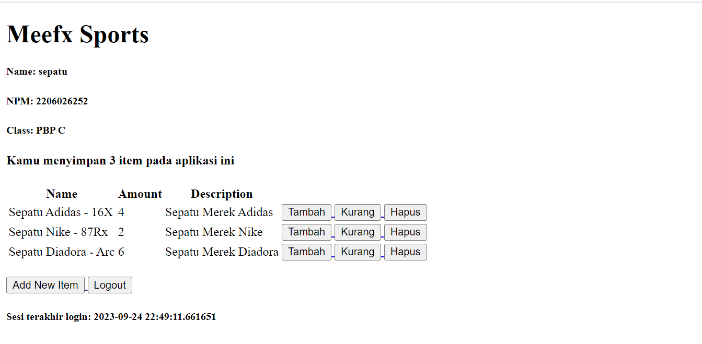
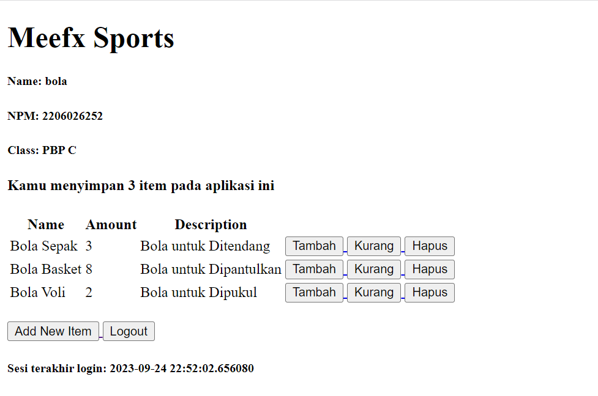

# Identitas Diri
**Nama: Muhammad Fakhri Robbani**

**NPM: 2206026252**

**Kelas: PBP C**


# Tugas 6: JavaScript dan Asynchronous JavaScript

1. **Jelaskan perbedaan antara asynchronous programming dengan synchronous programming.**

    Perbedaan antara asynchronous programming dan synchronous programming mencakup karakteristik dasar dalam arsitektur eksekusi tugas. Asynchronous merupakan arsitektur non-blocking, di mana eksekusi satu tugas tidak tergantung pada tugas lainnya, sehingga tugas-tugas dapat berjalan secara bersamaan. Sebaliknya, synchronous merupakan arsitektur blocking, di mana eksekusi setiap operasi bergantung pada penyelesaian operasi sebelumnya, sehingga setiap tugas memerlukan jawaban sebelum melanjutkan ke iterasi berikutnya.


    Selain itu, asynchronous bersifat multi-threaded, yang berarti operasi atau program dapat berjalan secara paralel sehingga meningkatkan throughput. Di sisi lain, synchronous adalah single-threaded, sehingga hanya satu operasi atau program yang berjalan pada satu waktu, yang membuatnya lebih lambat dan lebih metodenya.


    Asynchronous programming lebih disukai untuk pengguna karena meningkatkan pengalaman pengguna dengan mengurangi waktu tunda antara pemanggilan fungsi dan pengembalian nilai dari fungsi tersebut. Ini menghasilkan alur yang lebih cepat dan lancar. Di sisi lain, Synchronous programming lebih menguntungkan bagi para pengembang karena didukung oleh berbagai bahasa pemrograman dan menjadi metode pemrograman default, sehingga pengembang tidak perlu menghabiskan waktu mempelajari hal baru.

2. **Dalam penerapan JavaScript dan AJAX, terdapat penerapan paradigma event-driven programming. Jelaskan maksud dari paradigma tersebut dan sebutkan salah satu contoh penerapannya pada tugas ini.**

    Paradigma event-driven programming adalah pendekatan dalam pemrograman di mana program merespons events yang terjadi. Paradigma ini memiliki maksud bahwa aliran eksekusi program tidak hanya bergantung pada urutan kode yang kita tulis, tetapi bergantung pada peristiwa yang terjadi dalam lingkungan eksekusi.


    Dalam paradigma event-driven, program biasanya memiliki _event handler_ yang merespon peristiwa-peristiwa tertentu. Ketika peristiwa tersebut terjadi, program akan menjalankan kode yang telah ditetapkan untuk menangani peristiwa tersebut. Ini memungkinkan program untuk merespons secara dinamis terhadap input atau kondisi yang berubah tanpa harus berjalan dalam urutan yang tetap.


    Salah satu contoh pada kode yang saya buat adalah event handler terhadap button `Add Item AJAX`. Kode yang saya buat dapat memanggil kode yang menjalankan penambahan item jika user mengklik button tersebut. Berikut adalah kodenya


    ```javascript
    document.getElementById("button_add").onclick = addItem
    ```

3. **Jelaskan penerapan asynchronous programming pada AJAX.**

    Asynchronous AJAX, atau Asynchronous JavaScript and XML, beroperasi dengan memulai serangkaian peristiwa pada sebuah halaman web. Ketika suatu peristiwa pemicu terjadi, seperti halaman dimuat atau pengguna mengklik tombol, JavaScript membuat objek XMLHttpRequest untuk menjalin komunikasi dengan server web. Objek ini mengirimkan permintaan ke server, kemudian memprosesnya dan mengirimkan respons kembali ke browser. JavaScript terus menjalankan kode lain tanpa menunggu respons dari server, sehingga memastikan halaman web tetap responsif terhadap interaksi pengguna atau tugas lainnya. Setelah respons diterima, JavaScript menginterpretasinya dan mengambil tindakan yang sesuai, seperti memperbarui konten halaman web atau menjalankan operasi tambahan berdasarkan data yang diterima.

4. **Pada PBP kali ini, penerapan AJAX dilakukan dengan menggunakan Fetch API daripada library jQuery. Bandingkanlah kedua teknologi tersebut dan tuliskan pendapat kamu teknologi manakah yang lebih baik untuk digunakan.**

    | Fetch API                                      | JQuery                                              |
    | ------------------------------------------- | ------------------------------------------------- |
    | Kompleksitas relatif lebih rendah, API baru yang lebih modern | Kompleksitas relatif lebih tinggi, memiliki API yang lebih lengkap |
    | Ukuran file lebih kecil karena hanya API dasar | Lebih besar karena termasuk berbagai fitur tambahan |
    | Menggunakan Promises untuk mengelola respons async | Menggunakan callbacks atau Deferred objects |
    | Memungkinkan kustomisasi yang lebih tinggi   | Kustomisasi lebih terbatas pada respons            |
    | Memerlukan langkah tambahan untuk memanipulasi DOM | Memiliki fungsi-fungsi DOM yang terintegrasi       |


    Pemilihan antara Fetch API dan jQuery tergantung pada kebutuhan proyek dan preferensi pengembang. Fetch API cocok untuk proyek-proyek sederhana yang hanya memerlukan operasi dasar AJAX, sedangkan jQuery lebih sesuai untuk proyek yang memerlukan fitur-fitur tambahan seperti animasi, efek, dan manipulasi DOM yang lebih kuat. 


5. **Jelaskan bagaimana cara kamu mengimplementasikan checklist di atas secara step-by-step (bukan hanya sekadar mengikuti tutorial).**
    1. AJAX GET
        1. Ubahlah kode cards data item agar dapat mendukung AJAX GET.

            Pada cards data item, saya menghapus kode sebelumnya dan membuat sebuah attribut ID `item_card` pada tag div kosong yang nantinya akan menjadi tempat cards pada `main.html`. 

        2.  Lakukan pengambilan task menggunakan AJAX GET.

            Agar mendukung AJAX GET, pertama-tama, saya membuat sebuah fungsi baru bernama `get_item_json` yang mengambil semua item berdasarkan user yang login. Kemudian, saya routing ke `urls.py`. Lalu, pada `main.html` saya membuat block `&lt;scripts>` yang berisi fungsi asynchronous bernama `getItem` yang melakukan pengambilan data fetch API terhadap file json yang berasal dari `get_item_json` pada `views.py`.

    2.  AJAX POST
        1. Buatlah sebuah tombol yang membuka sebuah modal dengan form untuk menambahkan item.

            Saya membuat sebuah button baru yang diambil dari bootstrap dengan kode sebagai berikut.


            ```html
            <button type="button" class="btn btn-success" data-bs-toggle="modal" data-bs-target="#exampleModal">Add Item by AJAX</button>
            ```

        2. Buatlah fungsi view baru untuk menambahkan item baru ke dalam basis data.

            Pada `views.py` saya membuat sebuah fungsi baru bernama `add_item_ajax` yang digunakan untuk menambahkan item baru dan menggunakan `@csrf_exempt` sebagai atribut keamanan.

        3.  Buatlah path /create-ajax/ yang mengarah ke fungsi view yang baru kamu buat.

            Pada `urls.py` direktori `main`, saya membuat routing dengan path `/create-ajax/` dengan menambahkan baris berikut.

            ```python
            path('create-ajax/', add_item_ajax, name='add_item_ajax'),
            ```

        4.  Hubungkan form yang telah kamu buat di dalam modal kamu ke path /create-ajax/.

            Pada main.html, saya membuat sebuah modal yang berasal dari bootstrap, pada modal tersebut, saya membuat sebuah form yang dihubungkan dengan path `/create-ajax/` ketika user menekan button `Add Item`. Saya membuat sebuah fungsi `addItem` yang melakukan fetching data dari fungsi `add_item` pada views.py menggunakan method POST. Setelah data didapat, saya melakukan pemanggilan fungsi `refreshItem` yang berfungsi menampilkan setiap item yang ada pada cards dengan memanfaatkan htmlString dan manipulasi DOM terhadap tag id `item_card`pada div cards sebelumnya. Kemudian saya mereset field pada modal yang diinput user sebelumnya menggunakan method `reset()`. Selanjutnya saya memastikan agar fungsi tersebut aktif setelah user menekan button add_item dengan memanfaatkan kode

            ```javascript
            document.getElementById("button_add").onclick = addItem
            ``` 

        5.  Lakukan refresh pada halaman utama secara asinkronus untuk menampilkan daftar item terbaru tanpa reload halaman utama secara keseluruhan.

            Pada fungsi refreshItems(), saya melakukan looping terhadap item yang tersedia dan membuat htmlString yang berisi cards dari setiap itemnya. htmlString ini saya masukkan ke tag `&lt;div id=’item_card’>` yang saya buat sebelumnya melalui metode manipulasi DOM. Kemudian saya memanggil fungsi refreshItems() agar daftar item diperbarui secara asinkronus tanpa perlu melakukan reload halaman setiap kali terjadi perubahan.

    3. Melakukan perintah collectstatic.

        Untuk mengumpulkan file static dari setiap aplikasi ke dalam suatu folder agar mudah disajikan pada produksi, saya memangging perintah `python manage.py collectstatic` pada cmd root direktori. Setelah pemanggilan tersebut, akan terbentuk direktori `static/admin` yang isinya berbagai macam static files yang digunakan pada projek ini.


**References**

* Awati, R. (n.d.). What is Asynchronous JavaScript and XML (AJAX)? TheServerSide. Retrieved October 8, 2023, from https://www.theserverside.com/definition/Ajax-Asynchronous-JavaScript-and-XML

* Bevans, D. (2023, September 19). Explained: Asynchronous vs. Synchronous Programming. Mendix. Retrieved October 8, 2023, from https://www.mendix.com/blog/asynchronous-vs-synchronous-programming/


# Tugas 5: Desain Web menggunakan HTML, CSS dan Framework CSS

1. **Jelaskan manfaat dari setiap element selector dan kapan waktu yang tepat untuk menggunakannya.**
    1. Elemen selector merupakan salah satu jenis selector dalam CSS yang mana kita dapat melakukan perubahan properti untuk semua elemen yang memiliki tag HTML yang sama. Waktu yang tepat untuk menggunakan elemen selector adalah ketika kita ingin melakukan perubahan properti yang terikat ke elemen tag HTML seperti `<p> <h1> <h2>`, dan tag-tag HTML lainnya.
    
2. **Jelaskan HTML5 Tag yang kamu ketahui.**
    1. `<header>` digunakan untuk mendefinisikan bagian atas (header) dari sebuah elemen atau halaman web. Ini biasanya berisi judul, logo, menu navigasi, atau elemen-elemen lain yang terkait dengan bagian atas halaman.
    2. `<title>` Title merupakan judul yang akan ditampilkan pada tab title suatu website.
    3. `<body>`  digunakan untuk mengelompokkan semua konten yang akan ditampilkan di halaman web.
    4. `<h1>`     adalah elemen yang digunakan untuk mendefinisikan judul atau heading level 1 pada halaman web.
    5. `<p>` dalah elemen yang digunakan untuk mendefinisikan sebuah paragraf dalam teks di halaman web.
    6. `<div>`   digunakan untuk mengelompokkan dan menggabungkan elemen-elemen HTML dan biasanya berupa container untuk mengatur tata letak dan styling dengan CSS
    7. `<a>` digunakan untuk membuat tautan atau hyperlink ke halaman web lain atau sumber daya lainnya.
    8. `<footer>`    digunakan untuk mendefinisikan bagian bawah (footer) dari elemen atau halaman web. Ini biasanya berisi informasi kontak, hak cipta, atau tautan terkait lainnya.
    
3. **Jelaskan perbedaan antara margin dan padding.**

    Margin adalah ruang yang berada di luar batas luar elemen dan digunakan untuk mengatur jarak antara elemen tersebut dengan elemen-elemen lain di sekitarnya. Ini berfungsi sebagai "ruang luar" yang sifatnya transparan. Margin sering digunakan untuk mengatur tata letak elemen, seperti membuat jarak antara elemen-elemen yang berdekatan atau mengatur posisi elemen di halaman. Sedangkan, Padding adalah ruang yang berada di antara batas luar elemen dan kontennya. Ini berfungsi sebagai "ruang dalam" yang terlihat dan umumnya memiliki latar belakang dan warna yang sama dengan elemen itu sendiri. Padding digunakan untuk mengatur jarak antara konten elemen dan batas luar elemen tersebut.

4. **Jelaskan perbedaan antara framework CSS Tailwind dan Bootstrap. Kapan sebaiknya kita menggunakan Bootstrap daripada Tailwind, dan sebaliknya?**

    Framework CSS Tailwind dan Bootstrap memiliki perbedaan yang signifikan. Berikut adalah perbedaannya


    <table>
      <tr style="text-align:center";>
       <td>
    <strong>Tailwind</strong>
       </td>
       <td><strong>Bootstrap</strong>
       </td>
      </tr>
      <tr>
       <td>Memanfaatkan kelas-kelas utilitas yang telah didefinisikan sebelumnya untuk membangun tampilan.
       </td>
       <td>Menggunakan gaya dan komponen yang telah didefinisikan, yang memiliki tampilan yang sudah jadi dan dapat digunakan secara langsung.
       </td>
      </tr>
      <tr>
       <td>Memiliki file CSS yang lebih kecil karena hanya akan memuat kelas-kelas utilitas yang digunakan.
       </td>
       <td>Memiliki file CSS yang lebih besar karena termasuk banyak komponen yang telah didefinisikan.
       </td>
      </tr>
      <tr>
       <td>Memberikan fleksibilitas dan adaptabilitas tinggi terhadap proyek karena Anda dapat menyesuaikan setiap aspek tampilan sesuai kebutuhan.
       </td>
       <td>Seringkali menghasilkan tampilan yang lebih konsisten di seluruh proyek karena menggunakan komponen yang telah didefinisikan.
       </td>
      </tr>
      <tr>
       <td>Memiliki pembelajaran yang lebih <em>advance</em> karena memerlukan pemahaman terhadap kelas-kelas utilitas yang tersedia dan bagaimana menggabungkannya untuk mencapai tampilan yang diinginkan.
       </td>
       <td>Memiliki pembelajaran yang lebih cepat untuk pemula karena dapat mulai dengan komponen yang telah didefinisikan.
       </td>
      </tr>
    </table>


    Ketika memilih antara Bootstrap dan Tailwind CSS, perlu mempertimbangkan karakteristik masing-masing kerangka kerja dan kebutuhan proyek. Bootstrap cocok digunakan ketika konsistensi visual yang telah diatur dan dokumentasi yang kuat menjadi prioritas. Ini juga berguna dalam proyek dengan waktu terbatas atau oleh pemula yang ingin memulai dengan cepat. Sebaliknya, Tailwind CSS memberikan fleksibilitas tinggi dan tingkat kustomisasi yang dalam, cocok untuk proyek yang memerlukan tampilan yang sangat disesuaikan dan kontrol mendalam. Pilihan antara keduanya bergantung pada kebutuhan proyek dan tingkat kenyamanan dalam penggunaan masing-masing kerangka kerja. Beberapa pengembang mungkin juga memilih untuk menggabungkan Bootstrap dan Tailwind CSS dalam satu proyek untuk memanfaatkan kelebihan keduanya.


5. **Jelaskan bagaimana cara kamu mengimplementasikan checklist di atas secara step-by-step (bukan hanya sekadar mengikuti tutorial).**
    1. Kustomisasi halaman login, register, dan tambah inventori semenarik mungkin.
        1. Pada halaman login, register, dan tambah item, saya menggunakan bootstrap untuk melakukan modifikasi terhadap button dan juga merapihkan posisi-posisi elemen tersebut dengan memanfaatkan flex dan position pada  card dan tabel, saya juga menambahkan shadow border agar tampilan terlihat lebih menarik. Kemudian saya juga menempatkan card register dan login pada tengah halaman website agar terlihat lebih simetris. Kemudian pada halaman tambah_item, pada card header saya berikan warna agar warnanya tidak monoton.
    2.  Kustomisasi halaman daftar inventori menjadi lebih berwarna maupun menggunakan approach lain seperti menggunakan Card.
        1. Pada halaman daftar inventori, Saya membuat navigation bar pada bagian atas halaman website saya. Saya menambahkan navigation ke posisi-posisi yang saya ingin tampilkan pada halaman website saya menggunakan Bootstrap. Kemudian saya juga membuat tabel yang ditampilkan menjadi lebih terstruktur dan menambahkan border. Kemudian saya juga melakukan styling pada button agar terlihat lebih berwarna.
        2. Kemudian saya juga menampilkan bentuk lain dari inventory saya, yaitu menampilkan dalam bentuk card view dengan memanfaatkan card dari bootstrap. Kemudian saya melakukan penyesuaian terhadap margin untuk memberikan jarak antara card yang 1 dengan card yang lain.
        3. Terakhir saya juga melakukan penyesuaian tampilan pada halaman edit_product menggunakan tabel dan card agar terlihat lebih menarik.


# Tugas 4: Implementasi Autentikasi, Session, dan Cookies pada Django

1.  **Apa itu Django UserCreationForm, dan jelaskan apa kelebihan dan kekurangannya?**

    Django UserCreationForm adalah sebuah modul dari library django yang digunakan sebagai _form page_ untuk membentuk `user` baru yang dapat mengakses web aplikasi yang kita buat. Form ini memiliki tiga fields yaitu `username`, `password` dan `repeat_password`. Kelebihan dari modul ini adalah menawarkan fleksibilitas dan efisiensi terhadap programmer karena tidak perlu membuat form pembuatan user secara manual sehingga dapat menghemat waktu. Selain itu, modul ini juga sudah dibuat sesuai dengan standar username dan password sehingga developer juga tidak perlu menyesuaikan kriteria-kriteria password yang harus ada. Namun terdapat beberapa kekurangan yang dalam penggunaan Django UserCreationForm ini. Fitur yang ditawarkan pada modul ini tidak banyak sehingga masih memerlukan kustomisasi lebih lanjut apabila developer ingin menambahkan fitur. Selain itu, tampilan form yang ditampilkan masih standar sehingga perlu disesuaikan dengan desain web yang dibuat.

2.  **Apa perbedaan antara autentikasi dan otorisasi dalam konteks Django, dan mengapa keduanya penting?**

    Dalam Django, autentikasi merupakan suatu proses untuk memverifikasi suatu `user` yang hendak memasuki aplikasi yang kita bangun. Sedangkan otorisasi merupakan suatu proses untuk menentukan apa saja yang dapat diakses atau dilakukan oleh user yang telah diidentifikasi tersebut. Kedua proses ini penting karena kita perlu melakukan verifikasi siapa saja yang mengakses aplikasi yang kita gunakan serta membatasi konten-konten atau fitur terhadap otorisasi user tertentu untuk menjaga keamanan data dan memastikan setiap user mengakses fitur yang sesuai dengan _role_ nya masing-masing tanpa tercampur dengan fitur lain yang tidak berguna.

3.  **Apa itu cookies dalam konteks aplikasi web, dan bagaimana Django menggunakan cookies untuk mengelola data sesi pengguna?**

    Cookies merupakan sebagian kecil data yang dikirim ke browser website yang kita kunjungi. Sebagian kecil data ini membantu website yang kita kunjungi mengingat informasi mengenai kunjungan kita sehingga akan lebih mudah bagi kita ketika ingin mengunjungi website tersebut kembali. Django memiliki method dalam membuat dan mendapatkan cookies. Method untuk membuat cookies menggunakan perintah `set_cookie()` dan untuk mendapatkan cookies menggunakan perintah `get_cookie()`. Data cookie ini juga dapat disesuaikan dengan user sehingga data yang disimpan dapat dikelola dengan baik berdasarkan user.

4.  **Apakah penggunaan cookies aman secara default dalam pengembangan web, atau apakah ada risiko potensial yang harus diwaspadai?**

    Cookies dalam implementasi pengembangan web pada dasarnya aman, namun, perlu diingat bahwa jika data sensitif disimpan dalam cookies, hal ini bisa menjadi berpotensi berbahaya jika ditangani oleh pihak yang tidak sah. Ada beberapa risiko potensial yang perlu kita waspadai:

    1. **Kebocoran Informasi Pribadi**. Cookies sering digunakan untuk menyimpan data sensitif seperti token otentikasi atau nomor kartu kredit. Jika cookies ini tidak dienkripsi atau tidak diatur dengan baik, penyerang akan memanfaatkan peluang tersebut untuk mangakses data pribadi seseorang
    2. **Tidak terdapat batasan waktu penyimpanan Cookies**. Cookies yang tidak memiliki waktu kadaluwarsa yang sesuai dapat meningkatkan risiko keamanan. Cookies harus memiliki waktu kadaluwarsa yang tepat agar tidak menjadi sasaran serangan berbasis cookie. Jika cookies tetap aktif lebih lama dari yang seharusnya, penyerang dapat mengakses akun pengguna bahkan setelah pengguna keluar dari situs dalam waktu yang lama.
    3. **Kebocoran Informasi Perilaku Pengguna.** Bocornya informasi perilaku pengguna dapat menyebabkan penyerang mengetahui kapan kita biasanya _login_ atau mengakses sistem sehingga mereka dapat memanfaatkan peluang tersebut untuk masuk kedalam sistem kita.
    
5. **Jelaskan bagaimana cara kamu mengimplementasikan checklist di atas secara step-by-step (bukan hanya sekadar mengikuti tutorial).**
    1. Mengimplementasikan fungsi registrasi, login, dan logout untuk memungkinkan pengguna untuk mengakses aplikasi sebelumnya dengan lancar.
        * Membuat Fungsi Registrasi 

            Untuk membuat fitur registrasi, saya membuat fungsi yang menerima request user. Pada fungsi tersebut saya membuat sebuah form registrasi yang melakukan rendering ke _page_ registrasi lalu memanfaatkan Django UserCreationForm dengan memasukkan QueryDict berdasarkan input dari user pada request.POST. Setelah itu saya melakukan pengecekan apakah form tersebut valid dan menyimpan hasilnya serta menampilkan pesan bahwa akun telah sukses dibuat lalu kembali ke aplikasi utama menggunakan `redirect`. Kemudian saya membuat _Registration Page_ bernama `registration.html` yang disambungkan dengan template `base.html`. Pada page tersebut, saya memanggil form dari django dengan method `POST`  dan menampilkan pesan-pesan yang dihasilkan selama proses tersebut jika ada. Setelah itu, saya juga melakukan _routing_ fungsi tersebut ke file `urls.py` pada direktori aplikasi main.

        * Membuat Fungsi Login

            Pada fungsi login ini, saya memanfaatkan method `authenticate` dan `login` dari `django.contrib.auth`. Setelah itu, pada fungsi ini, saya membawa user ke page `login.html` yang saya buat untuk menampilkan halaman input username dan password dan tombol login serta register yang terhubung ke `register.html` apabila user ingin membuat akun. Setelah itu fungsi ini mengambil data username dan password yang nantinya akan dikirim user dengan `request.POST` dan melakukan autentikasi user. Apabila user terautentikasi, maka akan masuk ke halaman main dan jika gagal akan menampilkan pesan gagal login. Setelah itu, saya melakukan _routing_ fungsi login pada `urls.py` aplikasi main.

        * Membuat Fungsi Logout

            Dalam membuat fungsi ini, saya memanfaatkan modul `logout` dari `django.contrib.auth`. Pada fungsi ini, saya menggunakan `logout(request)` untuk menghapus sesi pengguna yang saat ini masuk dan melakukan redirect ke halaman login. Setelah itu, saya melakukan routing fungsi ini ke `urls.py` pada direktori main. Kemudian, pada `main.html` saya membuat button logout yang terhubung dengan halaman url _logout_ yang terhubung dengan `urls.py` tadi.

        * Melakukan Restriksi Main Application

            Untuk merestriksi aplikasi yang saya buat, saya memanfaatkan modul `login_required` dari `from django.contrib.auth.decorators`. Kemudian, sebelum fungsi `show_main(request)`, saya menambahkan kode agar merujuk ke halaman login terlebih dahulu sebelum bisa mengakses aplikasinya. Berikut adalah kodenya.


            ```python
            ...
            @login_required(login_url='/login')
            def show_main(request):
            ...
            ```

    2. Menghubungkan model Item dengan User.

        Pada `models.py` yang ada pada subdirektori `main`, saya menggunakan module `User` dari  `django.contrib.auth.models` untuk menghubungkan Item dengan user. Saya menambahkan field user pada model Item dengan kode berikut.


        ```python
        user = models.ForeignKey(User, on_delete=models.CASCADE)
        ```


        Kode ini digunakan untuk menghubungkan item dengan user melalui sebuah _relationship_. Sehingga setiap user dapat memiliki Itemnya masing-masing tanpa terikat dengan user lain. Kemudian, pada `views.py` subdirektori `main`. Saya memodifikasi kode berikut.


        ```python
        def create_product(request):
         form = ItemForm(request.POST or None)
         
         if form.is_valid() and request.method == "POST":
             item= form.save(commit=False)
             item.user = request.user
             item.save()
             return HttpResponseRedirect(reverse('main:show_main'))
         ...
        ```


        Pada modifikasi ini, saya membuat agar form di save tidak langsung ke databse menggunakan `commit=False` agar dapat dimodifikasi lebih lanjut. Kemudian, saya juga menambahkan `item.user = request.user` agar menandakan bahwa objek yang ditambahkan milik pengguna yang sedang login. Kemudian, saya melakukan migrasi model untuk menyimpan perubahan ke database. Lalu saya menetapkan default value user dengan ID 1.

    3. Menampilkan detail informasi pengguna yang sedang logged in seperti username dan menerapkan cookies seperti last login pada halaman utama aplikasi.

        Saya menggunakan module `datetime`, untuk menyimpan data last login ke cookies. Pertama, pada fungsi `login_user`, saya menambahkan cookie yang bernama `last_login` dengan mengganti kode pada fungi tersebut pada blok `if user is not None` menjadi kode berikut.


        ```python
        ...
        if user is not None:
            login(request, user)
            response = HttpResponseRedirect(reverse("main:show_main")) 
            response.set_cookie('last_login', str(datetime.datetime.now()))
            return response
        ...
        ```


        Pada kode ini, saya membuat agar setelah user terverifikasi, user dapat login dan membuat response. Pada saat itu, saya menambahkan cookie `last_login` dan menambahkannya ke response yang merujuk ke `show_main`. Kemudian, pada fungi `show_main`, saya menambahkan key `last_login` pada dictionary `context` yang mengambil cookies last_login terhadap request dari user yang nantinya akan ditampilkan ke halaman web dengan menambahkan pesan sesi terakhir login pada `main.html`. Lalu, saya memodifikasi fungsi logout user dengan menambahkan response serta melakukan delete_cookie `last_login`. Sehingga cookie `last_login` akan terhapus saat pengguna melakukan `logout`. Terakhir, saya menamodifikasi show_main pada variable `items` dan `name` menjadi seperti berikut.


        ```python
        def show_main(request):
            products = Product.objects.filter(user=request.user)
            context = {
                'name': request.user.username,
            ...
        ...
        ```


        Hal ini saya lakukan agar Item yang ditampilkan pada web itu merupakan item milik user yang login serta nama yang ditampilkan juga merupakan username user yang login.

    4. Membuat dua akun pengguna dengan masing-masing tiga dummy data menggunakan model yang telah dibuat pada aplikasi sebelumnya untuk setiap akun di lokal.

        **Akun 1:**
        ```
        Username: sepatu
        Password: apollo22
        ```


        <table style="text-align: center;">
          <tr>
           <td>
        <strong>Name</strong>
           </td>
           <td><strong>Amount</strong>
           </td>
           <td><strong>Desctription</strong>
           </td>
          </tr>
          <tr>
           <td>Sepatu Adidas - 16X
           </td>
           <td>4
           </td>
           <td>Sepatu Merek Adidas
           </td>
          </tr>
          <tr>
           <td>Sepatu Nike - 87Rx
           </td>
           <td>2
           </td>
           <td>Sepatu Merek Nike
           </td>
          </tr>
          <tr>
           <td>Sepatu Diadora  - Arc
           </td>
           <td>6
           </td>
           <td>Sepatu Merek Diadora
           </td>
          </tr>
        </table>


        **Akun 2:**

        ```
        Username: bola
        Password: apollo22
        ```

        <table style="text-align: center;">
          <tr>
           <td><strong>Name</strong>
           </td>
           <td><strong>Amount</strong>
           </td>
           <td><strong>Desctription</strong>
           </td>
          </tr>
          <tr>
           <td>Bola Sepak
           </td>
           <td>3
           </td>
           <td>Bola untuk Ditendang
           </td>
          </tr>
          <tr>
           <td>Bola Basket
           </td>
           <td>8
           </td>
           <td>Bola untuk Dipantulkan
           </td>
          </tr>
          <tr>
           <td>Bola Voli
           </td>
           <td>2
           </td>
           <td>Bola untuk Dipukul
           </td>
          </tr>
        </table>


        Berikut adalah hasil tampilan pada kedua akun:
        
        


# Tugas 3: Implementasi Form dan Data Delivery pada Django


1. **Apa perbedaan antara form `POST` dan form `GET` dalam Django?**

    `POST` dan `GET` merupakan method HTTP yang digunakan ketika berhubungan dengan _form_. Kedua method ini memiliki beberapa perbedaan sebagai berikut.
    
    1. Penggunaan
        1. Form `POST` digunakan ketika menerima sebuah _request_ yang memerlukan perubahan sistem seperti database dan server. Contohnya ketika mengirim data pengguna ke databse dari form pendaftaran.
        2.  Form `GET` digunakan ketika menerina sebuah request yang tidak memerlukan perubahan pada sistem. Contohnya ketika ingin melakukan pencarian suatu data.
    2. Kapasitas Data
        1. Form `POST` dapat mengirim data dalam jumlah yang besar karena dikirim dalam _HTTP Request Body_ sehingga tidak ada batasan panjang URL.
        2. Form `GET` memiliki batasan kapaistas dalam pengiriman data karena dikirim dalam _HTTP Request Header_ sehingga panjang URL terbatas.
    3. Keamanan Data
        1. Form `POST` lebih aman dalam mengirim data sensitif. Hal ini karena `POST` mengirim data melalui _request body_ sehingga tidak dapat terlihat pada URL dan log server.
        2. Form `GET` lebih baik digunakan untuk data yang sifatnya tidak sensitif. Hal ini karena `GET` mengirim data melalui _request header_ sehingga data ditampilkan melalui URL dan dapat dilihat melalui log server.
    4. Idempotency
        1. Form `POST` tidak bersifat Idempoten, artinya _request_ yang sama berulang kali dapat menghasilkan _result_ yang berbeda.
        2. Form `GET` bersifat Idempoten, artinya request yang sama berulang kali akan menghasilkan _result_ yang sama tanpa mengubah sistem atau database. 
2.  **Apa perbedaan utama antara XML, JSON, dan HTML dalam konteks pengiriman data?**
    1. Penggunaan
    
        XML dan JSON digunakan untuk menyimpan dan mentransmisi data, sedangkan HTML digunakan untuk menampilkan data dalam struktur website.
    
    2. Syntax
        1. XML menggunakan sintaks yang mewajibkan setiap elemennya dibungkus dengan tag.
        2. JSON menggunakan kurung kurawal `{}` dan memiliki struktur `key:value`. JSON juga _support_ penggunaan array menggunakan kurung siku `[]`.
        3. HTML menggunakan tag dengan banyak jenis yang masing-masing jenis tag menggambarkan elemen-elemen yang ditampilkan. Mirip seperti XML, HTML juga membungkus elemen yang ditampilkan dengan tag.
    3. Struktur Data
        1. XML memiliki struktur data yang ketat. Dokumen XML memiliki struktur seperti hirarki yang dimulai dari root, lalu branch, hingga berakhir pada leaves. Dokumen XML harus mengandung sebuah root element yang merupakan parent dari elemen lainnya.
        2. JSON memiliki struktur data berupa _key_ dan _value_ serta format filenya dalam bentuk _text_ sehingga file JSON dapat dibuat dan dibaca menggunakan berbagai macam bahasa pemrograman.
        3. HTML memiliki struktur data yang bebas dengan aturan data atau konten yang ditampilkan menggunakan tag yang sesuai dengan fungsinya masing-masing.
3.  **Mengapa JSON sering digunakan dalam pertukaran data antara aplikasi web modern?**

    JSON sering digunakan dalam pertukaran data antar aplikasi web modern karena memiliki banyak keunggulan. JSON memiliki desain self-describing dan bentuk data yang merepresentasikan `key` dan `value`, sehingga JSON sangat mudah untuk dimengerti. Selain itu, struktur data yang digunakan juga mendukung untuk objek dan array sehingga mudah digunakan oleh programmer. Meskipun merupakan turunan dari bahasa JavaScript, akan tetapi JSON menggunakan format teks sehingga kode untuk membuat dan membaca file JSON terdapat di berbagai macam bahasa pemrograman.

4.  **Jelaskan bagaimana cara kamu mengimplementasikan checklist di atas secara step-by-step (bukan hanya sekadar mengikuti tutorial).**
    1. Membuat input `form` untuk menambahkan objek model pada app sebelumnya.
        1. Membuat Kerangka Views

            Sebelum membuat form input data, saya membuat sebuah kerangka views untuk memastikan adanya konsistensi dalam desain web agar mengurangi kemungkinan redundansi kode. Saya membuat sebuah folder `templates` pada rood folder dan membuat sebuah template dasar pyoyek html bernama `base.html`. Pada file ini, saya menambahkan baris-baris kode sebagai tanda posisi kode dimana konten akan ditempatkan. Setelah itu, saya menyesuaikan `DIRS` pada `settings.py` agar dapat mendeteksi base.html sebagai berkas template. Selanjutnya saya mengubah kode `main.html` pada folder `templates` di folder aplikasi dengan menambahkan kode tanda bahwa file tersebut merupakan extends dari `base.html`dan kode block konten yang akan disambungkan ke template pada `base.html`.

        2. Membuat Form Input Data

            Langkah pertama yang saya lakukan dalam membuat form input data adalah membuat file struktur form baru bernama `forms.py` pada direktori `main`.saya membuat class `ItemForm` yang mengextend `ModelForm` dari `django.forms`, pada class tersebut saya melakukan inisiasi model `Item` yang saya import dari `main.models` dan melakukan inisiasi fields berupa array dari setiap instance pada model `Item`. Fields ini merupakan data-data yang akan dimintai input pada form. Setelah itu, pada `views.py` direktori `main`, saya membuat fungsi `create_item(request)` yang digunakan untuk menghasilkan formulir yang dapat menambahkan data item secara otomatis setelah data di-submit dari form. Pada fungsi ini, saya melakukan inisiasi form berdasarkan input dari user pada `request.POST` lalu melakukan validasi serta menyimpan data dari form tersebut dan melakukan _redirect_ setelah data form berhasil disimpan. Selanjutnya pada method `show_main()` pada file yang sama, saya menambahkan variabel baru `items` yang mengambil seluruh object Item yang tersimpan di database dan memasukkannya ke dictionary context dengan key `items`. Kemudian saya melakukan routing fungsi `create_item` ke `urls.py` agar dapat diakses dari proyek. 

        3. Menampilkan Form Input Data ke Peramban Web

            Untuk menampilkan form input data ke website, saya membuat file HTML baru pada folder `main/templates` bernama `create_item.html` yang merupakan extends dari `base.html`. Pada file ini, saya membuat form dengan method `POST` dan memanfaatkan kode `` berupa token yang berfungsi sebagai security. Kemudian dalam form tersebut, saya juga membuat tabel dan menampilkan _fields_ form yang sudah dibuat pada `forms.py` sebagai tabel. Terakhir, saya membuat tombol submit untuk mengirimkan _request_ ke fungsi `create_item(request)` pada `views.py`.

        4. Menampilkan Tabel Hasil Input Data dari User

            Saya menambahkan tabel pada file `main.html` yang berisi item-item yang sudah diinput oleh user. Untuk menampilkan item-item, saya menggunakan _looping_ setiap item yang ada pada database dan memasukkannya ke tabel. Saya juga menambahkan tombol `Add New Item` untuk merujuk ke halaman `create_item.html`.
            
        5. Menambahkan Informasi Banyak Item yang Tersedia pada Inventory

            Untuk menampilkan banyak item yang tersedia, saya menambahkan variabel baru bernama `items_count` pada fungsi `show_main(request)` di file `views.py` aplikasi `main`. Variabel ini saya isi dengan menghitung banyaknya objek item yang terinisiasi di model `Item` menggunakan kode `Item.objects.count()`. Kemudian saya menambahkan data `items_count` pada dictionary `context` agar dapat dirender ke file `main.html`. Setelah itu, saya menambahkan tag baru di `main.html` yang menampilkan jumlah item yang ada berdasarkan `items_count` di `context` pada `views.py`


    2. Tambahkan 5 fungsi views untuk melihat objek yang sudah ditambahkan dalam format HTML, XML, JSON, XML by ID, dan JSON by ID.
        1. Mengembalikan Data dalam Bentuk XML dan JSON

            Saya membuat penyimpanan data agar dapat dilihat dalam bentuk XML dan JSON. Saya membuat fungsi bernama `show_xml(request)` dan `show_json(request)` yang digunakan untuk menampilkan data dalam format XML dan JSON. Pada fungsi tersebut, saya mengambil seluruh data yang ada pada `Item` dan menyimpannya pada variabel `data`. Kemudian saya mengembalikan respon HTTP yang melakukan _translate_ objek model menjadi format XML untuk fungsi `show_xml(request)` dan JSON untuk fungsi `show_json(request)`. Setelah itu, saya melakukan routing fungsi yang saya buat tadi ke `urls.py` pada direktori aplikasi agar dapat diakses melalui URL.

        2. Mengembalikan Data berdasarkan ID XML dan JSON

            Pada tahap ini, saya membuat fungsi baru bernama `show_xml_by_id(request, id)` dan `show_json_by_id(request, id)` agar dapat mengakses data dengan format XML dan JSON berdasarkan ID pada datanya. Pada fungsi ini, saya melakukan _filtering_ objek `Item` berdasarkan ID yang diinginkan dan menyimpannya ke variabel `data`. Kemudian, saya mengembalikan respon HTTP yang melakukan translate objek model yang sudah di-_filter _menjadi format XML dan JSON. Setelah itu, saya melakukan routing ke `urls.py` dan membuat _URL path_ dapat disesuaikan berdasarkan angka ID nya menggunakan `<int:id>`.

5. **Screenshot hasil akses URL pada Postman**


# Tugas 2: Implementasi Model-View-Template (MVT) pada Django

1. **Jelaskan bagaimana cara kamu mengimplementasikan checklist di atas secara step-by-step (bukan hanya sekadar mengikuti tutorial).**

    1. **Membuat Project Django**

        Pertama-tama, saya membuat sebuah direktori lokal yang saya beri nama `meefx_sports` untuk menyimpan proyek Django baru yang akan saya buat. Selanjutnya, saya membuat virtual environment dengan nama folder `env` dan mengaktifkannya menggunakan perintah yang sesuai untuk sistem operasi saya. Setelah mengaktifkan virtual environment, langkah selanjutnya adalah menginstal library-library yang dibutuhkan untuk proyek saya. Ini penting agar proyek dapat berjalan dengan baik dan memenuhi kebutuhan fungsionalitasnya. Kemudian, saya membuat proyek Django dengan perintah `django-admin startproject meefx_sports .`, di mana `meefx_sports` adalah nama proyek saya. Proyek ini akan dibuat di dalam direktori yang telah saya persiapkan sebelumnya. Setelah proyek terbentuk, saya mengizinkan akses dari semua host melalui pengaturan pada berkas `settings.py`. Ini memungkinkan aplikasi yang akan saya kembangkan dapat diakses dari berbagai alamat IP. Setelah semua pengaturan awal selesai, saya memastikan bahwa proyek Django dapat berjalan dengan baik dengan menjalankan server Django pada localhost. Setelah proyek berjalan dengan sukses, saya mematikan virtual environment, dan langkah berikutnya adalah membuat berkas `.gitignore` untuk menentukan berkas-berkas dan direktori-direktori yang harus diabaikan oleh Git. Ini membantu menghindari masalah dengan repositori Git yang tidak perlu. Terakhir, saya membuat repositori GitHub dengan nama `meefx-sports` dan melakukan inisiasi direktori utama proyek lokal sebagai repositori Git dengan perintah `git init`. Setelah itu, saya menambahkan perubahan dengan menggunakan `git add`, melakukan commit, dan melakukan push ke branch `main` pada repositori yang telah saya buat.

    2. **Membuat aplikasi dengan nama main pada proyek tersebut.**

        Setelah project django terbentuk, saya mengaktifkan kembali virtual environment dan menjalankan perintah `python manage.py startapp main` untuk membuat direktori baru bernama `main` di dalam direktori proyek. Direktori ini akan menjadi struktur awal dalam proyek saya.

    3. **Melakukan routing pada proyek agar dapat menjalankan aplikasi main.**

        Setelah direktori `main` terbentuk, saya melakukan routing direktori aplikasi main agar dapat dijalankan pada proyek. Saya melakukan routing dengan menambahkan direktori aplikasi `main` pada `INSTALLED_APP` di file `settings.py`.  Saya juga membuat direktori `templates` pada direktori aplikasi `main` yang berisi `main.html` yang berisi judul, nama, npm, dan kelas. `main.html` ini dibuat sebagai template yang akan digunakan untuk menampilkan halaman web.

    4. **Membuat model pada aplikasi main dengan nama Item dan memiliki atribut wajib tertentu.**

        Pada direktori aplikasi `main`, saya membuat model pada file `models.py`. Model yang saya buat bernama `Item` yang berisi atribut-atribut `name` dengan tipe `CharField`, `amount` dengan tipe `IntegerField`. `description` dengan tipe `TextField`. Setelah model dibentuk, saya melakukan migrasi untuk melacak perubahan pada model basis data.

    5. **Membuat sebuah fungsi pada views.py untuk dikembalikan ke dalam sebuah template HTML yang menampilkan nama aplikasi serta nama dan kelas kamu.**

        Pada tahap ini, saya mengintegrasikan komponen MVT dengan menggunakan fungsi `render` dari `django.shortcut`. Setelah itu saya membuat fungsi `show_main` yang menerima parameter `request`. Fungsi ini akan mengatur permintaan HTTP dan mengembalikan tampilan yang sesuai. Pada fungsi ini saya membuat dictionary `context` sebagai struktur yang mengemas data yang akan ditampilkan berdasarkan request yang diberikan. Kemudian pada fungsi ini saya mengembalikan fungsi render yang menerima tiga parameter yaitu `request` yang merupakan request dari user, lalu `main.html` yang merupakan halaman html yang ingin ditampilkan, dan dictionary `context` berisi data yang akan diteruskan ke tampilan untuk digunakan sebagai tampilan dinamis. Setelah fungsi tersebut terbentuk, saya melakukan perubahan template pada `main.html` agar dapat menangkap tampilan data dinamis yang diberikan oleh fungsi `show_main`.

    6. **Membuat sebuah routing pada urls.py aplikasi main untuk memetakan fungsi yang telah dibuat pada views.py.**

        Selanjutnya, saya melakukan routing url agar aplikasi `main` dapat dijalankan melalui peramban web. Pertama, saya membuat file `urls.py` pada direktori aplikasi `main`. File `urls.py` tingkat aplikasi ini bertanggung jawab untuk mengatur rute URL yang terkait dengan aplikasi main. Saya membuat variabel `app_name = “main”` yang diberikan untuk memberikan nama unik pada pola URL dalam aplikasi. Selanjutnya saya memanfaatkan fungsi `path` dari `django.urls` untuk membuat pola URL dan memanfaatkan fungsi `show_main` dari `main.views` pada parameter path untuk ditampilkan. Setelah itu, saya menambahkan rute url aplikasi `main` pada `urls.py` yang berada pada direktori proyek agar rute URL pada tingkat proyek dapat terhubung dengan tampilan aplikasi `main`. 

    7. **Membuat dan Melakukan Unit Testing**

        Sebelum melakukan deploy, saya melakukan unit testing terlebih dahulu. Unit testing digunakan untuk mengecek apakah kode yang dibuat bekerja sesuai dengan keinginan. Pertama, saya membuat tes untuk mengecek apakah path URL `/main/` dapat diakses. Kedua, saya membuat  tes untuk mengecek apakah halaman `/main/` di-render menggunakan template `main.html`. Lalu saya menambahkan 3 test case baru dengan membuat sebuah objek `Item` dengan nama `Sepatu Badminton`, dengan jumlah `100` dan deksripsi `Bawahnya ada karetnya.`. 3 Test case ini dilakukan dengan menguji masing-masing atribut Item `name`, `amount`, dan `description` apakah sudah sesuai dengan yang dibuat atau tidak. Terakhir, saya menambahkan testcase apakah output dari `main.html` sesuai dengan ekspektasi.

    8. **Melakukan deployment ke Adaptable terhadap aplikasi yang sudah dibuat sehingga nantinya dapat diakses oleh teman-temanmu melalui Internet.**

        Setelah melakukan semua hal diatas, saya melakukan `git push` ke branch `main` untuk mengupdate repositori di GitHub. Selanjutnya saya mendeploy proyek `meefx-sports` pada repo github ke Adaptable.  Saya memilih template `Python App`, `PostgreSQL` sebagai _database_, dan `Python 3.10`. Saya menjalankan perintah `python manage.py migrate && gunicorn meefx_sports.wsgi` digunakan sebagai start command konfigurasi Adaptable. Setelah itu saya mendeploy dengan nama domain `meefx-sports`.

2. **Buatlah bagan yang berisi request client ke web aplikasi berbasis Django beserta responnya dan jelaskan pada bagan tersebut kaitan antara urls.py, views.py, models.py, dan berkas html.**


3. **Jelaskan mengapa kita menggunakan virtual environment? Apakah kita tetap dapat membuat aplikasi web berbasis Django tanpa menggunakan virtual environment?**

    Virtual Environment digunakan untuk menghindari konflik jika kita memiliki proyek lain dalam sistem lokal yang sama. Virtual Environment dapat mencegah terjadinya konflik versi library yang digunakan dalam setiap proyek yang kita buat. Selain itu, virtual environment membuat kita mudah dalam manajemen setiap proyeknya karena proyek kita sudah terisolasi satu dengan yang lain. Dalam membuat aplikasi web berbasis Django, kita dapat membuat proyek tanpa harus menggunakan virtual environment. Namun, hal ini merupakan suatu hal yang lebih baik dihindari karena dapat menyebabkan konflik apabila terdapat proyek-proyek django yang memiliki perbedaan versi library yang digunakan.

4. **Jelaskan apakah itu MVC, MVT, MVVM dan perbedaan dari ketiganya.**

    Model-View-Controller (MVC), Model-View-Presenter (MVT), dan Model-View-ViewModel (MVVM) merupakan rancangan arsitektur yang digunakan untuk  memisahkan fungsi aplikasi antara visualisasi, pemrosesan, dan manajemen data (Musyaffa, 2021). Model arsitektur ini dirancang agar mudah untuk diuji dan membuat pemeliharaan menjadi lebih sederhana. Masing-masing arsitektur memiliki perbedaan dalam pendekatan yang digunakan untuk mengelola suatu aplikasi.

    * MVC memanfaatkan Controller sebagai pengontrol Model dan View. View pada MVC ini merupakan tampilan yang akan ditampilkan pada halaman aplikasi yang dibuat.
    * MVT memanfaatkan View sebagai pengontrol Model dan Template. View pada MVT berbeda dengan MVC, dimana View pada MVC berfungsi sebagai Template, sedangkan View pada MVT berfungsi menggantikan Controller pada MVC.
    * MVVM mirip seperti MVC, namun View-Model pada MVVM terhubung langsung dengan view dan menggunakan teknik _databinding_ sehingga memungkinkan perubahan tampilan yang sesuai secara otomatis.

**References**


* Musyaffa, I. (2021, June 2). _MVC vs MVP vs MVVM : Apa Perbedaannya & Mana yang terbaik diantara ketiganya?a_. Agus Hermanto. Retrieved September 9, 2023, from https://agus-hermanto.com/blog/detail/mvc-vs-mvp-vs-mvvm-apa-perbedaannya-mana-yang-terbaik-diantara-ketiganya-a