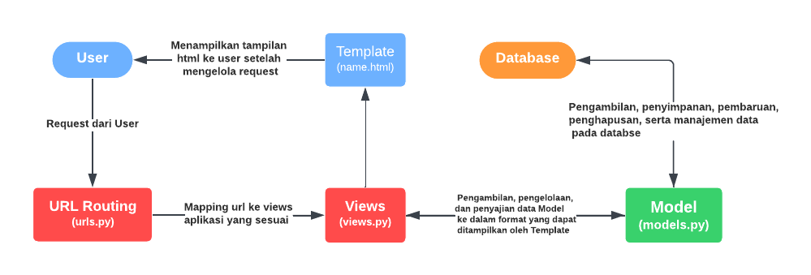
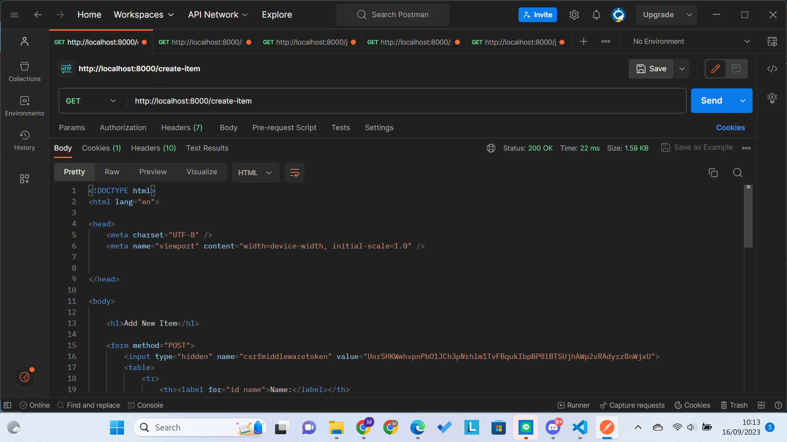
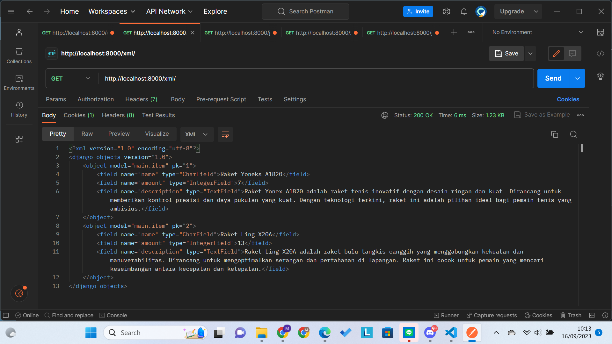
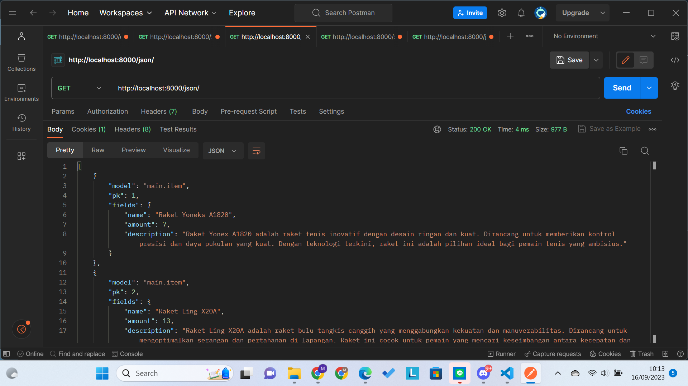
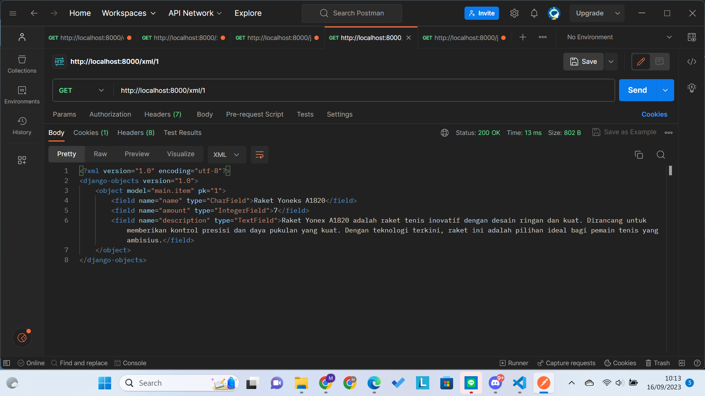
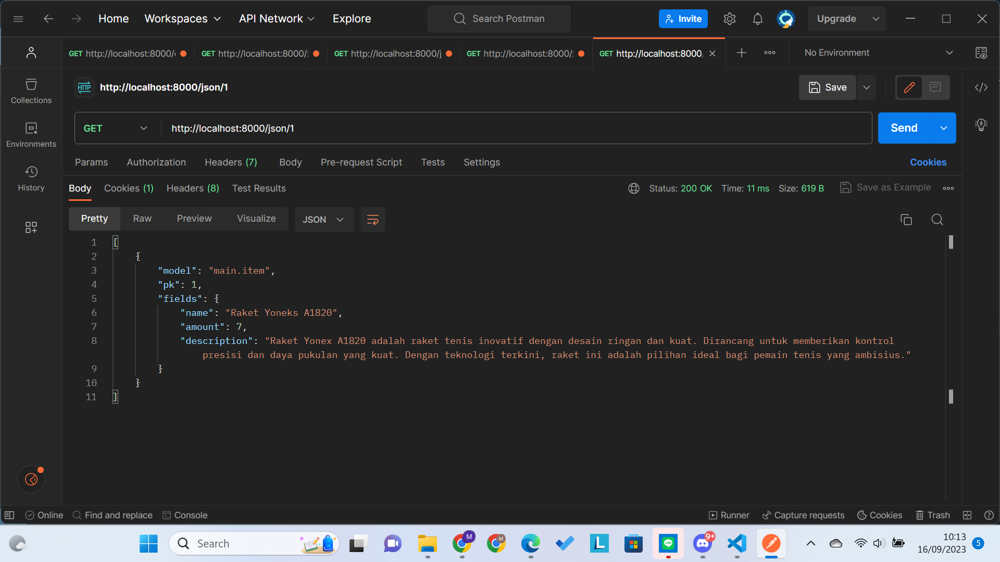

# Identitas Diri
**Nama: Muhammad Fakhri Robbani**

**NPM: 2206026252**

**Kelas: PBP C**

# Tugas 2: Implementasi Model-View-Template (MVT) pada Django

1. **Jelaskan bagaimana cara kamu mengimplementasikan checklist di atas secara step-by-step (bukan hanya sekadar mengikuti tutorial).**

    1. **Membuat Project Django**

        Pertama-tama, saya membuat sebuah direktori lokal yang saya beri nama `meefx_sports` untuk menyimpan proyek Django baru yang akan saya buat. Selanjutnya, saya membuat virtual environment dengan nama folder `env` dan mengaktifkannya menggunakan perintah yang sesuai untuk sistem operasi saya. Setelah mengaktifkan virtual environment, langkah selanjutnya adalah menginstal library-library yang dibutuhkan untuk proyek saya. Ini penting agar proyek dapat berjalan dengan baik dan memenuhi kebutuhan fungsionalitasnya. Kemudian, saya membuat proyek Django dengan perintah `django-admin startproject meefx_sports .`, di mana `meefx_sports` adalah nama proyek saya. Proyek ini akan dibuat di dalam direktori yang telah saya persiapkan sebelumnya. Setelah proyek terbentuk, saya mengizinkan akses dari semua host melalui pengaturan pada berkas `settings.py`. Ini memungkinkan aplikasi yang akan saya kembangkan dapat diakses dari berbagai alamat IP. Setelah semua pengaturan awal selesai, saya memastikan bahwa proyek Django dapat berjalan dengan baik dengan menjalankan server Django pada localhost. Setelah proyek berjalan dengan sukses, saya mematikan virtual environment, dan langkah berikutnya adalah membuat berkas `.gitignore` untuk menentukan berkas-berkas dan direktori-direktori yang harus diabaikan oleh Git. Ini membantu menghindari masalah dengan repositori Git yang tidak perlu. Terakhir, saya membuat repositori GitHub dengan nama `meefx-sports` dan melakukan inisiasi direktori utama proyek lokal sebagai repositori Git dengan perintah `git init`. Setelah itu, saya menambahkan perubahan dengan menggunakan `git add`, melakukan commit, dan melakukan push ke branch `main` pada repositori yang telah saya buat.

    2. **Membuat aplikasi dengan nama main pada proyek tersebut.**

        Setelah project django terbentuk, saya mengaktifkan kembali virtual environment dan menjalankan perintah `python manage.py startapp main` untuk membuat direktori baru bernama `main` di dalam direktori proyek. Direktori ini akan menjadi struktur awal dalam proyek saya.

    3. **Melakukan routing pada proyek agar dapat menjalankan aplikasi main.**

        Setelah direktori `main` terbentuk, saya melakukan routing direktori aplikasi main agar dapat dijalankan pada proyek. Saya melakukan routing dengan menambahkan direktori aplikasi `main` pada `INSTALLED_APP` di file `settings.py`.  Saya juga membuat direktori `templates` pada direktori aplikasi `main` yang berisi `main.html` yang berisi judul, nama, npm, dan kelas. `main.html` ini dibuat sebagai template yang akan digunakan untuk menampilkan halaman web.

    4. **Membuat model pada aplikasi main dengan nama Item dan memiliki atribut wajib tertentu.**

        Pada direktori aplikasi `main`, saya membuat model pada file `models.py`. Model yang saya buat bernama `Item` yang berisi atribut-atribut `name` dengan tipe `CharField`, `amount` dengan tipe `IntegerField`. `description` dengan tipe `TextField`. Setelah model dibentuk, saya melakukan migrasi untuk melacak perubahan pada model basis data.

    5. **Membuat sebuah fungsi pada views.py untuk dikembalikan ke dalam sebuah template HTML yang menampilkan nama aplikasi serta nama dan kelas kamu.**

        Pada tahap ini, saya mengintegrasikan komponen MVT dengan menggunakan fungsi `render` dari `django.shortcut`. Setelah itu saya membuat fungsi `show_main` yang menerima parameter `request`. Fungsi ini akan mengatur permintaan HTTP dan mengembalikan tampilan yang sesuai. Pada fungsi ini saya membuat dictionary `context` sebagai struktur yang mengemas data yang akan ditampilkan berdasarkan request yang diberikan. Kemudian pada fungsi ini saya mengembalikan fungsi render yang menerima tiga parameter yaitu `request` yang merupakan request dari user, lalu `main.html` yang merupakan halaman html yang ingin ditampilkan, dan dictionary `context` berisi data yang akan diteruskan ke tampilan untuk digunakan sebagai tampilan dinamis. Setelah fungsi tersebut terbentuk, saya melakukan perubahan template pada `main.html` agar dapat menangkap tampilan data dinamis yang diberikan oleh fungsi `show_main`.

    6. **Membuat sebuah routing pada urls.py aplikasi main untuk memetakan fungsi yang telah dibuat pada views.py.**

        Selanjutnya, saya melakukan routing url agar aplikasi `main` dapat dijalankan melalui peramban web. Pertama, saya membuat file `urls.py` pada direktori aplikasi `main`. File `urls.py` tingkat aplikasi ini bertanggung jawab untuk mengatur rute URL yang terkait dengan aplikasi main. Saya membuat variabel `app_name = “main”` yang diberikan untuk memberikan nama unik pada pola URL dalam aplikasi. Selanjutnya saya memanfaatkan fungsi `path` dari `django.urls` untuk membuat pola URL dan memanfaatkan fungsi `show_main` dari `main.views` pada parameter path untuk ditampilkan. Setelah itu, saya menambahkan rute url aplikasi `main` pada `urls.py` yang berada pada direktori proyek agar rute URL pada tingkat proyek dapat terhubung dengan tampilan aplikasi `main`. 

    7. **Membuat dan Melakukan Unit Testing**

        Sebelum melakukan deploy, saya melakukan unit testing terlebih dahulu. Unit testing digunakan untuk mengecek apakah kode yang dibuat bekerja sesuai dengan keinginan. Pertama, saya membuat tes untuk mengecek apakah path URL `/main/` dapat diakses. Kedua, saya membuat  tes untuk mengecek apakah halaman `/main/` di-render menggunakan template `main.html`. Lalu saya menambahkan 3 test case baru dengan membuat sebuah objek `Item` dengan nama `Sepatu Badminton`, dengan jumlah `100` dan deksripsi `Bawahnya ada karetnya.`. 3 Test case ini dilakukan dengan menguji masing-masing atribut Item `name`, `amount`, dan `description` apakah sudah sesuai dengan yang dibuat atau tidak. Terakhir, saya menambahkan testcase apakah output dari `main.html` sesuai dengan ekspektasi.

    8. **Melakukan deployment ke Adaptable terhadap aplikasi yang sudah dibuat sehingga nantinya dapat diakses oleh teman-temanmu melalui Internet.**

        Setelah melakukan semua hal diatas, saya melakukan `git push` ke branch `main` untuk mengupdate repositori di GitHub. Selanjutnya saya mendeploy proyek `meefx-sports` pada repo github ke Adaptable.  Saya memilih template `Python App`, `PostgreSQL` sebagai _database_, dan `Python 3.10`. Saya menjalankan perintah `python manage.py migrate && gunicorn meefx_sports.wsgi` digunakan sebagai start command konfigurasi Adaptable. Setelah itu saya mendeploy dengan nama domain `meefx-sports`.

2. **Buatlah bagan yang berisi request client ke web aplikasi berbasis Django beserta responnya dan jelaskan pada bagan tersebut kaitan antara urls.py, views.py, models.py, dan berkas html.**

3. **Jelaskan mengapa kita menggunakan virtual environment? Apakah kita tetap dapat membuat aplikasi web berbasis Django tanpa menggunakan virtual environment?**

    Virtual Environment digunakan untuk menghindari konflik jika kita memiliki proyek lain dalam sistem lokal yang sama. Virtual Environment dapat mencegah terjadinya konflik versi library yang digunakan dalam setiap proyek yang kita buat. Selain itu, virtual environment membuat kita mudah dalam manajemen setiap proyeknya karena proyek kita sudah terisolasi satu dengan yang lain. Dalam membuat aplikasi web berbasis Django, kita dapat membuat proyek tanpa harus menggunakan virtual environment. Namun, hal ini merupakan suatu hal yang lebih baik dihindari karena dapat menyebabkan konflik apabila terdapat proyek-proyek django yang memiliki perbedaan versi library yang digunakan.

4. **Jelaskan apakah itu MVC, MVT, MVVM dan perbedaan dari ketiganya.**

    Model-View-Controller (MVC), Model-View-Presenter (MVT), dan Model-View-ViewModel (MVVM) merupakan rancangan arsitektur yang digunakan untuk  memisahkan fungsi aplikasi antara visualisasi, pemrosesan, dan manajemen data (Musyaffa, 2021). Model arsitektur ini dirancang agar mudah untuk diuji dan membuat pemeliharaan menjadi lebih sederhana. Masing-masing arsitektur memiliki perbedaan dalam pendekatan yang digunakan untuk mengelola suatu aplikasi.

    * MVC memanfaatkan Controller sebagai pengontrol Model dan View. View pada MVC ini merupakan tampilan yang akan ditampilkan pada halaman aplikasi yang dibuat.
    * MVT memanfaatkan View sebagai pengontrol Model dan Template. View pada MVT berbeda dengan MVC, dimana View pada MVC berfungsi sebagai Template, sedangkan View pada MVT berfungsi menggantikan Controller pada MVC.
    * MVVM mirip seperti MVC, namun View-Model pada MVVM terhubung langsung dengan view dan menggunakan teknik _databinding_ sehingga memungkinkan perubahan tampilan yang sesuai secara otomatis.

**References**

* Musyaffa, I. (2021, June 2). _MVC vs MVP vs MVVM : Apa Perbedaannya & Mana yang terbaik diantara ketiganya?a_. Agus Hermanto. Retrieved September 9, 2023, from https://agus-hermanto.com/blog/detail/mvc-vs-mvp-vs-mvvm-apa-perbedaannya-mana-yang-terbaik-diantara-ketiganya-a

# Tugas 3: Implementasi Form dan Data Delivery pada Django

1. **Apa perbedaan antara form `POST` dan form `GET` dalam Django?**

    `POST` dan `GET` merupakan method HTTP yang digunakan ketika berhubungan dengan _form_. Kedua method ini memiliki beberapa perbedaan sebagai berikut.
    
    1. Penggunaan
        1. Form `POST` digunakan ketika menerima sebuah _request_ yang memerlukan perubahan sistem seperti database dan server. Contohnya ketika mengirim data pengguna ke databse dari form pendaftaran.
        2.  Form `GET` digunakan ketika menerina sebuah request yang tidak memerlukan perubahan pada sistem. Contohnya ketika ingin melakukan pencarian suatu data.
    2. Kapasitas Data
        1. Form `POST` dapat mengirim data dalam jumlah yang besar karena dikirim dalam _HTTP Request Body_ sehingga tidak ada batasan panjang URL.
        2. Form `GET` memiliki batasan kapaistas dalam pengiriman data karena dikirim dalam _HTTP Request Header_ sehingga panjang URL terbatas.
    3. Keamanan Data
        1. Form `POST` lebih aman dalam mengirim data sensitif. Hal ini karena `POST` mengirim data melalui _request body_ sehingga tidak dapat terlihat pada URL dan log server.
        2. Form `GET` lebih baik digunakan untuk data yang sifatnya tidak sensitif. Hal ini karena `GET` mengirim data melalui _request header_ sehingga data ditampilkan melalui URL dan dapat dilihat melalui log server.
    4. Idempotency
        1. Form `POST` tidak bersifat Idempoten, artinya _request_ yang sama berulang kali dapat menghasilkan _result_ yang berbeda.
        2. Form `GET` bersifat Idempoten, artinya request yang sama berulang kali akan menghasilkan _result_ yang sama tanpa mengubah sistem atau database. 
2.  **Apa perbedaan utama antara XML, JSON, dan HTML dalam konteks pengiriman data?**
    1. Penggunaan
    
        XML dan JSON digunakan untuk menyimpan dan mentransmisi data, sedangkan HTML digunakan untuk menampilkan data dalam struktur website.
    
    2. Syntax
        1. XML menggunakan sintaks yang mewajibkan setiap elemennya dibungkus dengan tag.
        2. JSON menggunakan kurung kurawal `{}` dan memiliki struktur `key:value`. JSON juga _support_ penggunaan array menggunakan kurung siku `[]`.
        3. HTML menggunakan tag dengan banyak jenis yang masing-masing jenis tag menggambarkan elemen-elemen yang ditampilkan. Mirip seperti XML, HTML juga membungkus elemen yang ditampilkan dengan tag.
    3. Struktur Data
        1. XML memiliki struktur data yang ketat. Dokumen XML memiliki struktur seperti hirarki yang dimulai dari root, lalu branch, hingga berakhir pada leaves. Dokumen XML harus mengandung sebuah root element yang merupakan parent dari elemen lainnya.
        2. JSON memiliki struktur data berupa _key_ dan _value_ serta format filenya dalam bentuk _text_ sehingga file JSON dapat dibuat dan dibaca menggunakan berbagai macam bahasa pemrograman.
        3. HTML memiliki struktur data yang bebas dengan aturan data atau konten yang ditampilkan menggunakan tag yang sesuai dengan fungsinya masing-masing.
3.  **Mengapa JSON sering digunakan dalam pertukaran data antara aplikasi web modern?**

    JSON sering digunakan dalam pertukaran data antar aplikasi web modern karena memiliki banyak keunggulan. JSON memiliki desain self-describing dan bentuk data yang merepresentasikan `key` dan `value`, sehingga JSON sangat mudah untuk dimengerti. Selain itu, struktur data yang digunakan juga mendukung untuk objek dan array sehingga mudah digunakan oleh programmer. Meskipun merupakan turunan dari bahasa JavaScript, akan tetapi JSON menggunakan format teks sehingga kode untuk membuat dan membaca file JSON terdapat di berbagai macam bahasa pemrograman.

4.  **Jelaskan bagaimana cara kamu mengimplementasikan checklist di atas secara step-by-step (bukan hanya sekadar mengikuti tutorial).**
    1. Membuat input `form` untuk menambahkan objek model pada app sebelumnya.
        1. Membuat Kerangka Views

            Sebelum membuat form input data, saya membuat sebuah kerangka views untuk memastikan adanya konsistensi dalam desain web agar mengurangi kemungkinan redundansi kode. Saya membuat sebuah folder `templates` pada rood folder dan membuat sebuah template dasar pyoyek html bernama `base.html`. Pada file ini, saya menambahkan baris-baris kode sebagai tanda posisi kode dimana konten akan ditempatkan. Setelah itu, saya menyesuaikan `DIRS` pada `settings.py` agar dapat mendeteksi base.html sebagai berkas template. Selanjutnya saya mengubah kode `main.html` pada folder `templates` di folder aplikasi dengan menambahkan kode tanda bahwa file tersebut merupakan extends dari `base.html`dan kode block konten yang akan disambungkan ke template pada `base.html`.

        2. Membuat Form Input Data

            Langkah pertama yang saya lakukan dalam membuat form input data adalah membuat file struktur form baru bernama `forms.py` pada direktori `main`.saya membuat class `ItemForm` yang mengextend `ModelForm` dari `django.forms`, pada class tersebut saya melakukan inisiasi model `Item` yang saya import dari `main.models` dan melakukan inisiasi fields berupa array dari setiap instance pada model `Item`. Fields ini merupakan data-data yang akan dimintai input pada form. Setelah itu, pada `views.py` direktori `main`, saya membuat fungsi `create_item(request)` yang digunakan untuk menghasilkan formulir yang dapat menambahkan data item secara otomatis setelah data di-submit dari form. Pada fungsi ini, saya melakukan inisiasi form berdasarkan input dari user pada `request.POST` lalu melakukan validasi serta menyimpan data dari form tersebut dan melakukan _redirect_ setelah data form berhasil disimpan. Selanjutnya pada method `show_main()` pada file yang sama, saya menambahkan variabel baru `items` yang mengambil seluruh object Item yang tersimpan di database dan memasukkannya ke dictionary context dengan key `items`. Kemudian saya melakukan routing fungsi `create_item` ke `urls.py` agar dapat diakses dari proyek. 

        3. Menampilkan Form Input Data ke Peramban Web

            Untuk menampilkan form input data ke website, saya membuat file HTML baru pada folder `main/templates` bernama `create_item.html` yang merupakan extends dari `base.html`. Pada file ini, saya membuat form dengan method `POST` dan memanfaatkan kode `` berupa token yang berfungsi sebagai security. Kemudian dalam form tersebut, saya juga membuat tabel dan menampilkan _fields_ form yang sudah dibuat pada `forms.py` sebagai tabel. Terakhir, saya membuat tombol submit untuk mengirimkan _request_ ke fungsi `create_item(request)` pada `views.py`.

        4. Menampilkan Tabel Hasil Input Data dari User

            Saya menambahkan tabel pada file `main.html` yang berisi item-item yang sudah diinput oleh user. Untuk menampilkan item-item, saya menggunakan _looping_ setiap item yang ada pada database dan memasukkannya ke tabel. Saya juga menambahkan tombol `Add New Item` untuk merujuk ke halaman `create_item.html`.
            
        5. Menambahkan Informasi Banyak Item yang Tersedia pada Inventory

            Untuk menampilkan banyak item yang tersedia, saya menambahkan variabel baru bernama `items_count` pada fungsi `show_main(request)` di file `views.py` aplikasi `main`. Variabel ini saya isi dengan menghitung banyaknya objek item yang terinisiasi di model `Item` menggunakan kode `Item.objects.count()`. Kemudian saya menambahkan data `items_count` pada dictionary `context` agar dapat dirender ke file `main.html`. Setelah itu, saya menambahkan tag baru di `main.html` yang menampilkan jumlah item yang ada berdasarkan `items_count` di `context` pada `views.py`

    2. Tambahkan 5 fungsi views untuk melihat objek yang sudah ditambahkan dalam format HTML, XML, JSON, XML by ID, dan JSON by ID.
        1. Mengembalikan Data dalam Bentuk XML dan JSON

            Saya membuat penyimpanan data agar dapat dilihat dalam bentuk XML dan JSON. Saya membuat fungsi bernama `show_xml(request)` dan `show_json(request)` yang digunakan untuk menampilkan data dalam format XML dan JSON. Pada fungsi tersebut, saya mengambil seluruh data yang ada pada `Item` dan menyimpannya pada variabel `data`. Kemudian saya mengembalikan respon HTTP yang melakukan _translate_ objek model menjadi format XML untuk fungsi `show_xml(request)` dan JSON untuk fungsi `show_json(request)`. Setelah itu, saya melakukan routing fungsi yang saya buat tadi ke `urls.py` pada direktori aplikasi agar dapat diakses melalui URL.

        2. Mengembalikan Data berdasarkan ID XML dan JSON

            Pada tahap ini, saya membuat fungsi baru bernama `show_xml_by_id(request, id)` dan `show_json_by_id(request, id)` agar dapat mengakses data dengan format XML dan JSON berdasarkan ID pada datanya. Pada fungsi ini, saya melakukan _filtering_ objek `Item` berdasarkan ID yang diinginkan dan menyimpannya ke variabel `data`. Kemudian, saya mengembalikan respon HTTP yang melakukan translate objek model yang sudah di-_filter _menjadi format XML dan JSON. Setelah itu, saya melakukan routing ke `urls.py` dan membuat _URL path_ dapat disesuaikan berdasarkan angka ID nya menggunakan `<int:id>`.

5. **Screenshot hasil akses URL pada Postman**

